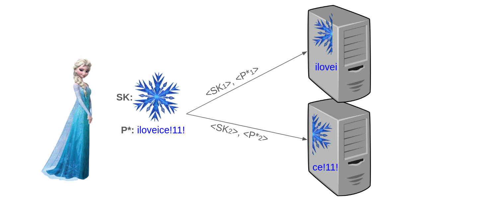
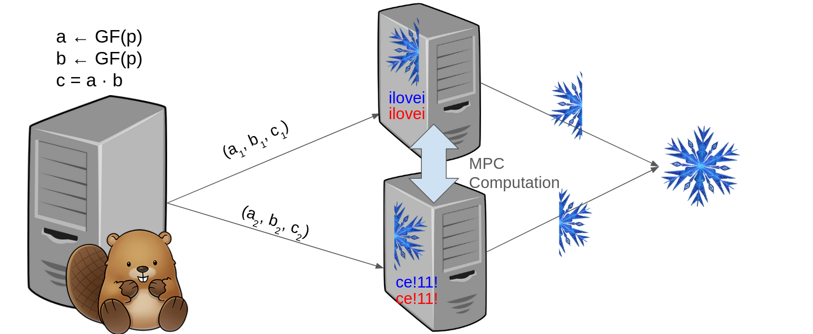
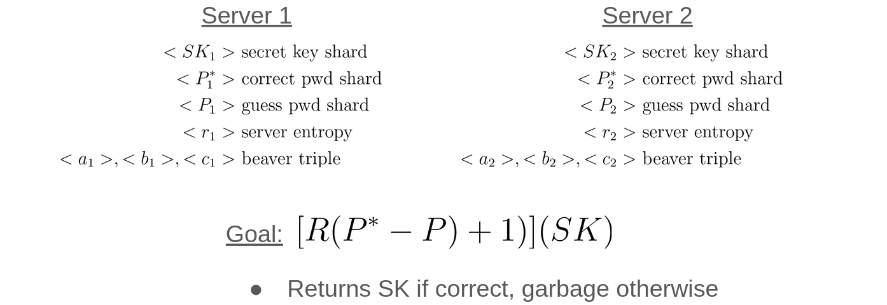

# Secret Key Recovery
**Group Members**: Allison Li, Michael Ren, Yuwen Zhang \
**Google slide presentation**: [Link to slides](https://docs.google.com/presentation/d/1u1Br2Mme98Wht2vrZYd0OYpvr5GDZNZZfiXFLk-RHWU/edit?usp=sharing)

## What it is
The SK recovery module provides a framework for a secret key recovery protocol distributed across multiple nodes. \
Users can upload their secret key along with a password which can be used to recover the secret key. These pieces of data are sharded on the client side before being uploaded to any servers.\
 When a user wants to recover their key, they can submit a password guess. Each server gets a shard of the guess, and then they perform an MPC to verify if the password is correct. If so, they send their shards of the secret key back to the user.

## Design and Architecture
Our protocol includes two phases: key registraion and key recovery. The examples below show the case where there are `N=2` servers; however our code supports any arbitrary number of servers.

### Key Registration
The user uploads Shamir secret shares of secret key and password independently to each server.

### Key Recovery
The user uploads password guess shards independently to each server. The servers communicate to perform an MPC and verify if the password guess was correct. ~~A separate beaver triple server provides beaver triples to the servers that are needed for the MPC circuit.~~


### MPC
The specific MPC that the server's calculate is outlined below. The sharding scheme shown is additive.
* If the password guess is correct, the circuit evaluates to the secret key.
* If the password guess is incorrect, the circuit evaluates to a random value.


## Module Design
We use [arkworks](https://github.com/arkworks-rs/algebra) for the finite-field arithmetic used in the MPC. Since the MPC circuit itself is quite simple, we chose to compute the circuit discretely rather than relying on a separate MPC library such as MP-SPDZ. We chose arkworks because members of our group already had prior experience with the library and we knew its capabilities would be sufficient for our project.
For our client-server model, we bootstrap off the initial template provided in `core-modules/pki`.

## Threat Model
Under the assumption that Alice shards her secret key into `N` shares:
* Servers are semi-honest: compromised servers will still faithfully execute the protocol.
* There are no more than `N-1` colluding MPC servers.
* DOS attacks are not possible.

If these requirements are met, then it is guaranteed that Alice can recover her secret key, and an attacker who doesn't know Alice's password can recover Alice's secret key with negligible probability.


# Running the program
All commands should be executed from the `skrecovery` module: `cd core-modules/skrecovery` from the dtrust root.
### 0. Install Dependencies
Install all the non-Cargo packages outlined in the [Dependencies](#dependencies) section. Cargo packages can be installed like so:

```bash
cargo build
```

### 1. Setup Nodes
#### 1.1 Server Configuration
First configure the server nodes in `server_conf.yml`. Any number of servers can be added. The default configuration runs with five servers; the first `N-1` servers are always MPC servers, and the last server is always the beaver triple server.

Ensure that the application configuration stanza is present in the server config. By default, the client uses the application name `skrecovery`. If this repository is cloned as a sibling of the <https://github.com/dtrust-project/dots-server> repo, the following stanza should work:

```yaml
apps:
  skrecovery:
    path: ../skrecovery-app/target/debug/rust_app
```

#### 1.2 Client Configuration
In `client/main.rs:93` add the addresses of all the servers in `server_conf.yml` to the `node_addrs` list. If you changed the name of the application from `skrecovery` in the server config, update the `APP_NAME` constant, as well.

#### 1.3 Start Nodes

Run the following command in one terminal in the DoTS server repo.
```bash
./start-n.sh 0 <N-1>
```

Where `<N-1>` is the number of servers minus one, or the index of the last server node.


### 2. Commands
In another terminal, execute the following commands to register/recover secret keys.
#### Initialize seeds to use for key recovery step
```bash
$ cargo run --bin client seed_prgs
```
#### Upload a secret key and password
```bash
$ cargo run --bin client upload_sk_and_pwd my_id my_sk my_pwd
```
#### Recover the secret key with a password guess
```bash
$ cargo run --bin client recover_sk my_id my_pwd
```

# Dependencies
See `Cargo.toml` for dependencies and `Cargo.lock` for the specific versions.
The following other dependencies should be preinstalled on the system as well. Provided version numbers are the ones that we ran on, but other versions may work as well.
* [rustc](https://www.rust-lang.org/tools/install) 1.65.0 (897e37553 2022-11-02)
* [yq](https://github.com/mikefarah/yq/) 4.30.5
* [grpcio](https://pypi.org/project/grpcio/) 1.51.1

# Tests
* `utils.rs` contains two functions `test_shard()` and `test_shard_to_bytes()` which can be used to verify the behavior of their respective functions. 
* We also tested the server by running the code ourselves and feeding it correct and incorrect password guesses.

## Upload secret key and password
```bash
$ cargo run --bin client upload_sk_and_pwd client_id 1234567890 client_pwd
Finished dev [unoptimized + debuginfo] target(s) in 0.09s
Running `target/debug/client upload_sk_and_pwd client_id 1234567890 client_pwd`
Uploading sk 1234567890, pwd client_pwd for user client_id
sk_field: Fp256 "(00000000000000000000000000000000000000000000000000000000499602D2)"
RESPONSE=Response { metadata: MetadataMap { headers: {"content-type": "application/grpc", "grpc-accept-encoding": "identity, deflate, gzip", "grpc-status": "0"} }, message: Result { result: "success" }, extensions: Extensions }
RESPONSE=Response { metadata: MetadataMap { headers: {"content-type": "application/grpc", "grpc-accept-encoding": "identity, deflate, gzip", "grpc-status": "0"} }, message: Result { result: "success" }, extensions: Extensions }
RESPONSE=Response { metadata: MetadataMap { headers: {"content-type": "application/grpc", "grpc-accept-encoding": "identity, deflate, gzip", "grpc-status": "0"} }, message: Result { result: "success" }, extensions: Extensions }
Results: [Ok(Ok(())), Ok(Ok(())), Ok(Ok(()))]
pwd_field: Fp256 "(000000000000000000000000000000000000000000006477705F746E65696C63)"
RESPONSE=Response { metadata: MetadataMap { headers: {"content-type": "application/grpc", "grpc-accept-encoding": "identity, deflate, gzip", "grpc-status": "0"} }, message: Result { result: "success" }, extensions: Extensions }
RESPONSE=Response { metadata: MetadataMap { headers: {"content-type": "application/grpc", "grpc-accept-encoding": "identity, deflate, gzip", "grpc-status": "0"} }, message: Result { result: "success" }, extensions: Extensions }
RESPONSE=Response { metadata: MetadataMap { headers: {"content-type": "application/grpc", "grpc-accept-encoding": "identity, deflate, gzip", "grpc-status": "0"} }, message: Result { result: "success" }, extensions: Extensions }
Results: [Ok(Ok(())), Ok(Ok(())), Ok(Ok(()))]
```

## Terminal output from a correct guess
```bash
$ cargo run --bin client recover_sk client_id client_pwd
Finished dev [unoptimized + debuginfo] target(s) in 0.12s
Running `target/debug/client recover_sk client_id client_pwd`
Uploading guess ...
RESPONSE=Response { metadata: MetadataMap { headers: {"content-type": "application/grpc", "grpc-accept-encoding": "identity, deflate, gzip", "grpc-status": "0"} }, message: Result { result: "success" }, extensions: Extensions }
RESPONSE=Response { metadata: MetadataMap { headers: {"content-type": "application/grpc", "grpc-accept-encoding": "identity, deflate, gzip", "grpc-status": "0"} }, message: Result { result: "success" }, extensions: Extensions }
RESPONSE=Response { metadata: MetadataMap { headers: {"content-type": "application/grpc", "grpc-accept-encoding": "identity, deflate, gzip", "grpc-status": "0"} }, message: Result { result: "success" }, extensions: Extensions }
Results: [Ok(Ok(())), Ok(Ok(())), Ok(Ok(()))]
Guess uploaded
Recovering sk with pwd guess Fp256 "(000000000000000000000000000000000000000000006477705F746E65696C63)", for user client_id
RESPONSE=Response { metadata: MetadataMap { headers: {"content-type": "application/grpc", "grpc-accept-encoding": "identity, deflate, gzip", "grpc-status": "0"} }, message: Result { result: "success" }, extensions: Extensions }
RESPONSE=Response { metadata: MetadataMap { headers: {"content-type": "application/grpc", "grpc-accept-encoding": "identity, deflate, gzip", "grpc-status": "0"} }, message: Result { result: "success" }, extensions: Extensions }
RESPONSE=Response { metadata: MetadataMap { headers: {"content-type": "application/grpc", "grpc-accept-encoding": "identity, deflate, gzip", "grpc-status": "0"} }, message: Result { result: "success" }, extensions: Extensions }
Results: [Ok(Ok(())), Ok(Ok(())), Ok(Ok(()))]
Aggregating SK on client
Blob=Response { metadata: MetadataMap { headers: {"content-type": "application/grpc", "grpc-accept-encoding": "identity, deflate, gzip", "grpc-status": "0"} }, message: Blob { key: "client_idrecovered_sk.txt", val: [], client_id: "" }, extensions: Extensions }
Blob=Response { metadata: MetadataMap { headers: {"content-type": "application/grpc", "grpc-accept-encoding": "identity, deflate, gzip", "grpc-status": "0"} }, message: Blob { key: "client_idrecovered_sk.txt", val: [75, 168, 74, 148, 242, 186, 53, 137, 227, 237, 225, 235, 69, 207, 116, 76, 124, 247, 114, 250, 9, 57, 55, 162, 4, 49, 41, 139, 250, 127, 45, 86], client_id: "" }, extensions: Extensions }
Blob=Response { metadata: MetadataMap { headers: {"content-type": "application/grpc", "grpc-accept-encoding": "identity, deflate, gzip", "grpc-status": "0"} }, message: Blob { key: "client_idrecovered_sk.txt", val: [136, 90, 75, 181, 12, 69, 202, 118, 27, 110, 28, 20, 189, 212, 72, 7, 137, 224, 46, 15, 254, 158, 2, 145, 67, 76, 116, 158, 88, 39, 192, 29], client_id: "" }, extensions: Extensions }
Blobs: [[75, 168, 74, 148, 242, 186, 53, 137, 227, 237, 225, 235, 69, 207, 116, 76, 124, 247, 114, 250, 9,57, 55, 162, 4, 49, 41, 139, 250, 127, 45, 86], [136, 90, 75, 181, 12, 69, 202, 118, 27, 110, 28, 20, 189, 212, 72, 7, 137, 224, 46, 15, 254, 158, 2, 145, 67, 76, 116, 158, 88, 39, 192, 29], []]
Recovered sk: Fp256 "(00000000000000000000000000000000000000000000000000000000499602D2)"
```

## Terminal output from an incorrect guess
```bash
$ cargo run --bin client recover_sk client_id client_WRONG_pwd
Finished dev [unoptimized + debuginfo] target(s) in 0.10s
Running `target/debug/client recover_sk client_id client_WRONG_pwd`
Uploading guess ...
RESPONSE=Response { metadata: MetadataMap { headers: {"content-type": "application/grpc", "grpc-accept-encoding": "identity, deflate, gzip", "grpc-status": "0"} }, message: Result { result: "success" }, extensions: Extensions }
RESPONSE=Response { metadata: MetadataMap { headers: {"content-type": "application/grpc", "grpc-accept-encoding": "identity, deflate, gzip", "grpc-status": "0"} }, message: Result { result: "success" }, extensions: Extensions }
RESPONSE=Response { metadata: MetadataMap { headers: {"content-type": "application/grpc", "grpc-accept-encoding": "identity, deflate, gzip", "grpc-status": "0"} }, message: Result { result: "success" }, extensions: Extensions }
Results: [Ok(Ok(())), Ok(Ok(())), Ok(Ok(()))]
Guess uploaded
Recovering sk with pwd guess Fp256 "(000000000000000000000000000000006477705F474E4F52575F746E65696C63)", for user client_id
RESPONSE=Response { metadata: MetadataMap { headers: {"content-type": "application/grpc", "grpc-accept-encoding": "identity, deflate, gzip", "grpc-status": "0"} }, message: Result { result: "success" }, extensions: Extensions }
RESPONSE=Response { metadata: MetadataMap { headers: {"content-type": "application/grpc", "grpc-accept-encoding": "identity, deflate, gzip", "grpc-status": "0"} }, message: Result { result: "success" }, extensions: Extensions }
RESPONSE=Response { metadata: MetadataMap { headers: {"content-type": "application/grpc", "grpc-accept-encoding": "identity, deflate, gzip", "grpc-status": "0"} }, message: Result { result: "success" }, extensions: Extensions }
Results: [Ok(Ok(())), Ok(Ok(())), Ok(Ok(()))]
Aggregating SK on client
Blob=Response { metadata: MetadataMap { headers: {"content-type": "application/grpc", "grpc-accept-encoding": "identity, deflate, gzip", "grpc-status": "0"} }, message: Blob { key: "client_idrecovered_sk.txt", val: [], client_id: "" }, extensions: Extensions }
Blob=Response { metadata: MetadataMap { headers: {"content-type": "application/grpc", "grpc-accept-encoding": "identity, deflate, gzip", "grpc-status": "0"} }, message: Blob { key: "client_idrecovered_sk.txt", val: [230, 126, 252, 220, 181, 49, 38, 248, 182, 60, 54, 122, 234, 97, 174, 230, 33, 92, 176, 134, 227, 0, 195, 188, 71, 44, 58, 166, 72, 71, 53, 96], client_id: "" }, extensions: Extensions }
Blob=Response { metadata: MetadataMap { headers: {"content-type": "application/grpc", "grpc-accept-encoding": "identity, deflate, gzip", "grpc-status": "0"} }, message: Blob { key: "client_idrecovered_sk.txt", val: [114, 211, 175, 154, 115, 98, 116, 230, 247, 29, 167, 43, 67, 132, 111, 161, 199, 118, 0, 31, 207, 124,85, 116, 250, 8, 236, 10, 174, 234, 69, 57], client_id: "" }, extensions: Extensions }
Blobs: [[230, 126, 252, 220, 181, 49, 38, 248, 182, 60, 54, 122, 234, 97, 174, 230, 33, 92, 176, 134, 227,0, 195, 188, 71, 44, 58, 166, 72, 71, 53, 96], [114, 211, 175, 154, 115, 98, 116, 230, 247, 29, 167, 43, 67, 132, 111, 161, 199, 118, 0, 31, 207, 124, 85, 116, 250, 8, 236, 10, 174, 234, 69, 57], []]
Recovered sk: Fp256 "(258D8AA38788B7F9FDDEA5AA9C0EFAE43460422AA5DEFEAFDE9A942A77AC5257)"
```

# Future work
* Evaluate performance as the number of participating servers / shards increases.
* Add signatures to all messages between client/server and server/server. This would improve our threat model to protection against malicious attackers rather than semi-honest ones. Some work has already been done in this direction. See `core-modules/signing` for the current progress.
* Integrate TLS for secure network communication between client/server and server/server
* Use oblivious transfer or homomorphic encryption to securely generate beaver triples without the need for a discrete beaver triple server.
