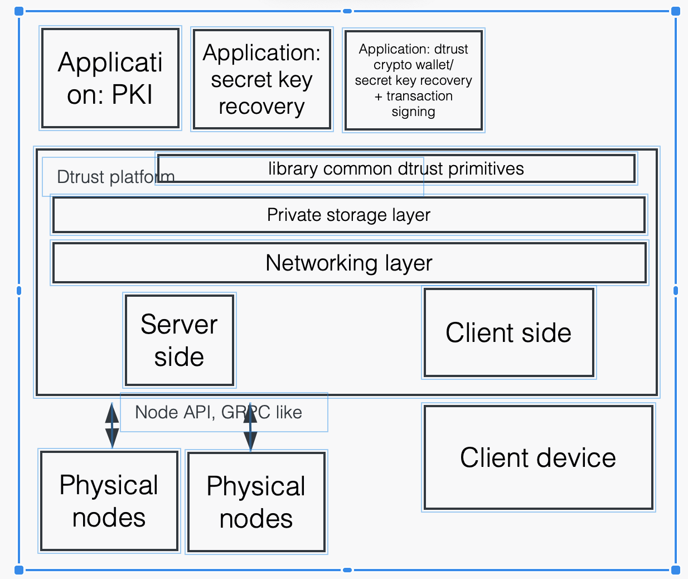

# Berkeley DoTS: The Berkeley Decentralized Trust Stack

***Caveat: This codebase is currently close-sourced. We plan to have it open-sourced at the end of the class. Until then, please do not distribute this repo to anyone outside this class.***

Distributing trust has become a fundamental principle in building many of today's applications. However, developing and deploying distributed applications remained challenging. Berkeley Dots is a platform for users to easily develop, test, and deploy applications with distributed trust. Here are some example real-world applications with distributed trust that can be built from Berkeley Dots:

### Cryptocurrency wallet custody
People claim ownership to crypto assets and authorize transactions using private keys. If these keys are lost, then the user permanently lose access to their assets. To protect these private keys, cryptocurrency custody service (e.g. Fireblocks) distribute the keys to multiple servers. Each server holds a secret share of the key, and the servers jointly run secure multi-party computation to authorize transactions with the key.

### Federated blockchain bridges.
Blockchain bridges enable users to transfer crypto assets or data between two different chains. A federated bridge distributes trust among a committee of stakeholders, who jointly facilitates the transfer of funds. A user that wants to transfer fund to another blockchain would first lock his assets from the source chain into the bridge. The committee then runs an MPC algorithm to jointly produce a minting signature. The user can use this signature to claim a respective token on the destination chain. 

### Distributed PKI
A Distributed Public key infrastructure (PKI) logs clients' public keys on multiple servers. These servers jointly maintain a consistent global view of users' public key. A user can check if his public key is not tampered with by comparing if the public keys stored on these servers are equal to each other.  


### Collaborative learning/analytics.
Multiple organizations (e.g. banks, hospitals) wants to jointly train a ML model or performing analytics using their sensitive data. They can use MPC to run collaborative learning/analytics without revealing their sensitive data to each other. 


## Getting Started
Our platform can run on MacOS and Linux. Windows is currently not supported. 

### 1. Installing Protocol Buffer Compiler
First, make sure `protoc` is installed on your machine, and its version is 3+. If not, follow [https://grpc.io/docs/protoc-installation/](https://grpc.io/docs/protoc-installation/) to install it.

On linux:
```bash
$ apt install -y protobuf-compiler
$ protoc --version  # Ensure compiler version is 3+
```
On MacOS, using Homebrew:
```bash
$ brew install protobuf
$ protoc --version  # Ensure compiler version is 3+
```

### 2. Installing Rust
Follow the instruction on [https://www.rust-lang.org/tools/install](https://www.rust-lang.org/tools/install) to install Rust on your machine.

### 3. Initializing decentralized nodes
First, we need to initialize the DTrust platform on multiple servers. We can use the `init_server` command to initialize a private node on a server. The `init_server` command takes a `node_id` and config file (`server_conf.yml`) as input, and initialize the node according to the config. The bash script below will initialize two servers with `node1` and `node2` as their `node_id` respectively.  You need to open two terminals to execute the following commands.

On terminal 1:
```bash
./platform/init_server --node_id node1 --config ./core-modules/pki/server_conf.yml
```

On terminal 2:
```bash
./platform/init_server --node_id node2 --config ./core-modules/pki/server_conf.yml
```

### 4. Running an example application
The `core-modules/pki` folder contains an example application called distributed PKI (public key infrastructure) written in Rust. This app enables a client to store his public key on multiple nodes. Other clients who want to talk to this client can then retrieve the public key from these servers. To run the client, open a another terminal and type in the following commands. 

```bash
cd core-modules/pki
cargo build
cargo run --bin client "upload_pk" "user1" "random_public_key"
cargo run --bin client "recover_pk" "user1"
```

You should see the message: "recovered public-key: "random_public_key"" at the bottom of your screen.


## Workflow of a decentralized application
The BDots platform consists of a client and multiple decentralized nodes (servers). The client interacts with the nodes through gRPC requests. BDots provide network connections between these servers, handles file storage, and offers common crypto primitives (under development) for applications built on top of the platform. Below is a diagram that outline the overall architecture of BDots.


A typical decentralized application consists of the following steps:
1. A client performs some local pre-computation, and uploads the results of the pre-computations to the servers. The pre-computation results are stored as files on the servers.
2. The client initiates a request to execute a decentralized app remotely on the servers. The servers take the input files as specified by the client, jointly executes the decentralized app, and stores the results to output files specified by the client. 
3. The client downloads the results from the servers, and performs some post-computation on the results locally.

The above workflow only provides a general guideline for developing decentralized applications. A decentralized application does not need to follow these steps exactly. Each step is separate and composable from each other, and can be optional depending on the specific application you are building. For example, an app that does secret-key recovery does not have any server side computations, so it can skip step 2.  

# Tutorials
To learn more about the BDoTS platform as well as this example application, checkout our [tutorial](tutorial.md). The tutorial will equip you with the necessary knowledge to develop your own decentralized applications on BDoTS.

# Join our Discord channels
If you are have any questions or want to hear about our latest updates, come join our [discord](https://discord.gg/uVVyTFDpXV) channel.